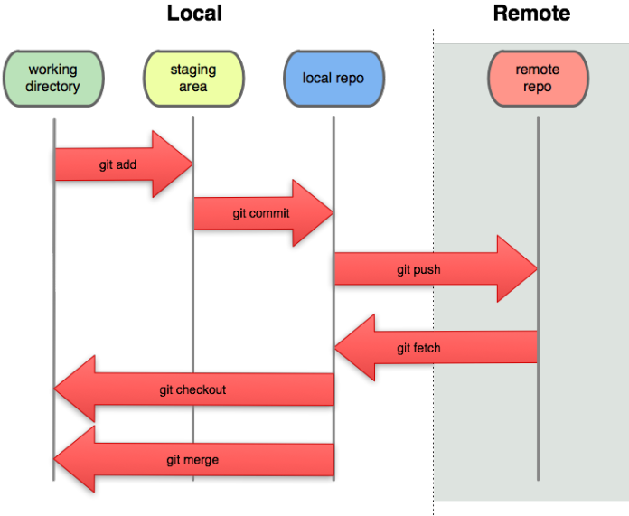

## - Lệnh git add: đẩy file từ working directory lên staging area 

## - Lệnh git commit: đẩy file từ staging area lên localrepo

## - Lệnh git push: đưa lên remote repo

## - Lệnh git pull kéo code của người khác về

## - git conflict